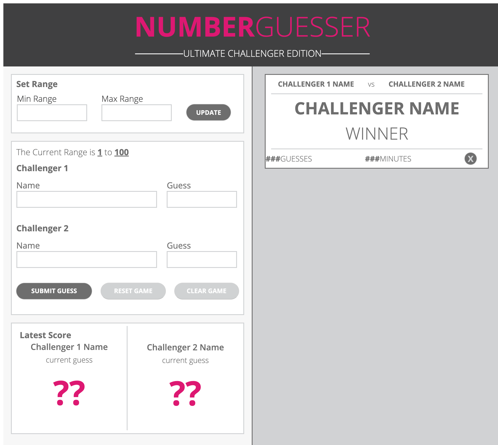

# Number Guesser Doubles

### Project Objective

Build a game based on users ability to choose their number range and attempt to guess a random number. We were provided with a comp as a guide for our HTML content and CSS styles. There were four phases with components to be met. 

### Our Process 

We started out this project together by whiteboarding our HTML. Knowing that there would be several elements to target we discussed and agreed on class names that made sense to both of us. Majority of our code was written together, taking turns driving and navigating. When we had all of the required content in out HTML we moved on to the style in out CSS. We used percentages where we could to help with viewability. This was also our first project utilizing flexbox, and it was very helpful in reaching our layout. 

Before writing any of our JavaScript code, we whiteboarded again, focusing on the elements we would need to manipulate. As we began psudocoding that visual was very helpful in creating our query selectors. We worked through all the components of phase one. Our game has a customizable range that updates on the page and generates a random number. There are input fields for each player's name and their guesses. When those inputs are submitted the data populates below with a message indicating if each guess is too high, too low, or BOOM!(if number is guessed). Our clear button clears the name and guess input fields but maintains the same random number. The reset button also clears the inputs but generates a new random number from the previously selected range. This range can be adjusted seperatly if desired. The reset and clear buttons are disabled until all 4 required input fields are filled. 

We began working on phase two componets and had some ideas of how to implement them but did not have time to gain enough understanding to include them. It was very important to both of us to only include code that we fully understood. As you will see below there is a template of a winner card. We didn't make it to the step of actually generating it from a win, but wanted to show what it would look like. 

Additionally, we had hoped to incorporate media queries, but were focused on meeting the components of the first couple of phases. Despite not making it as far as we would have liked, we both learned a lot and would like to use this project as a tool to pracitice and implement new code and functions as we grow and learn.

## A screen shot of our project

